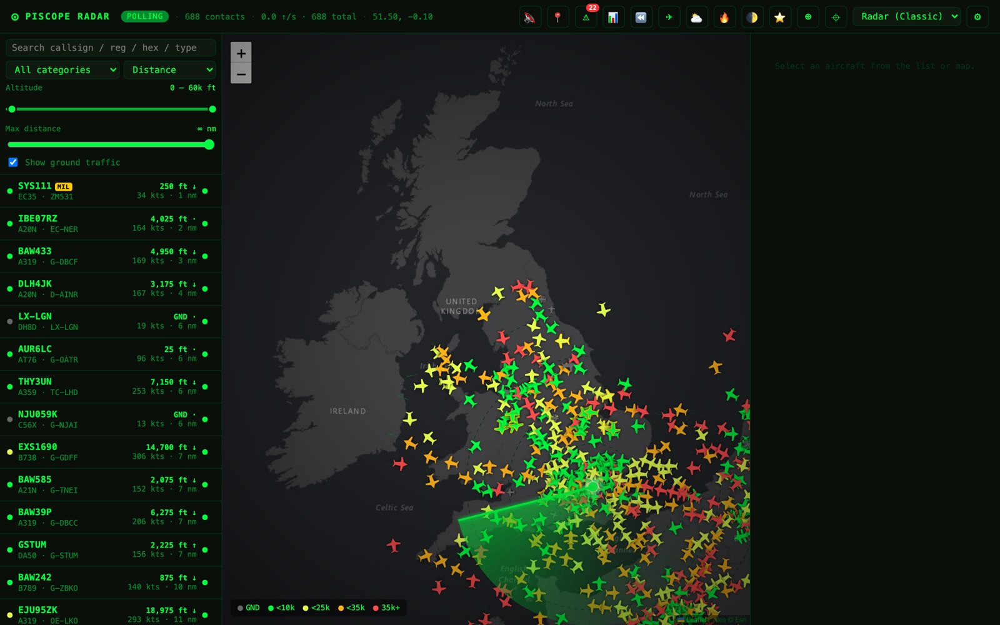
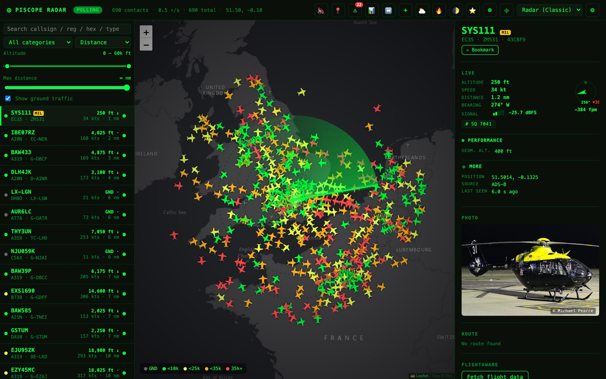
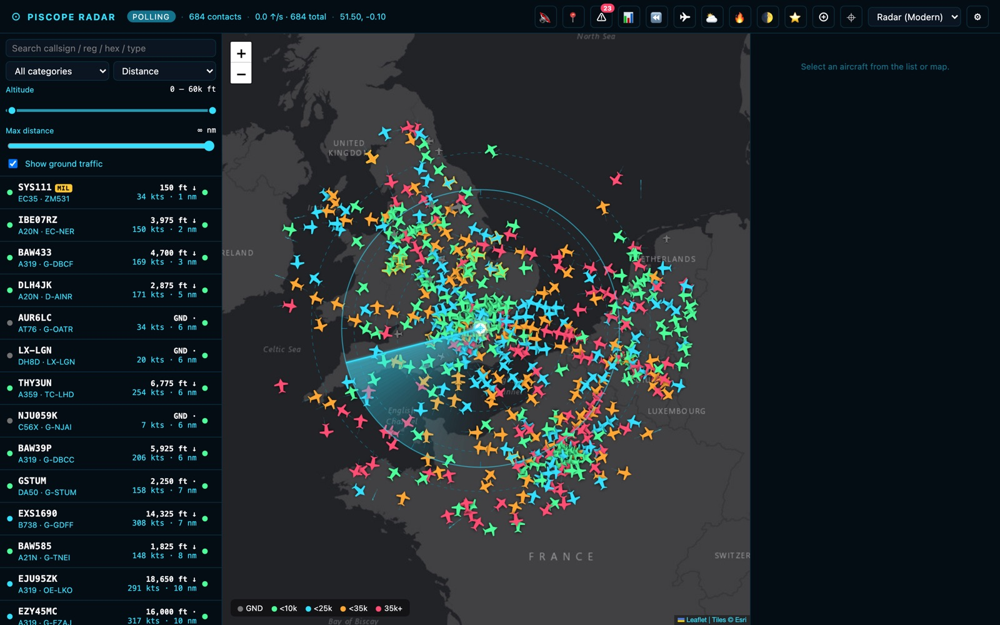
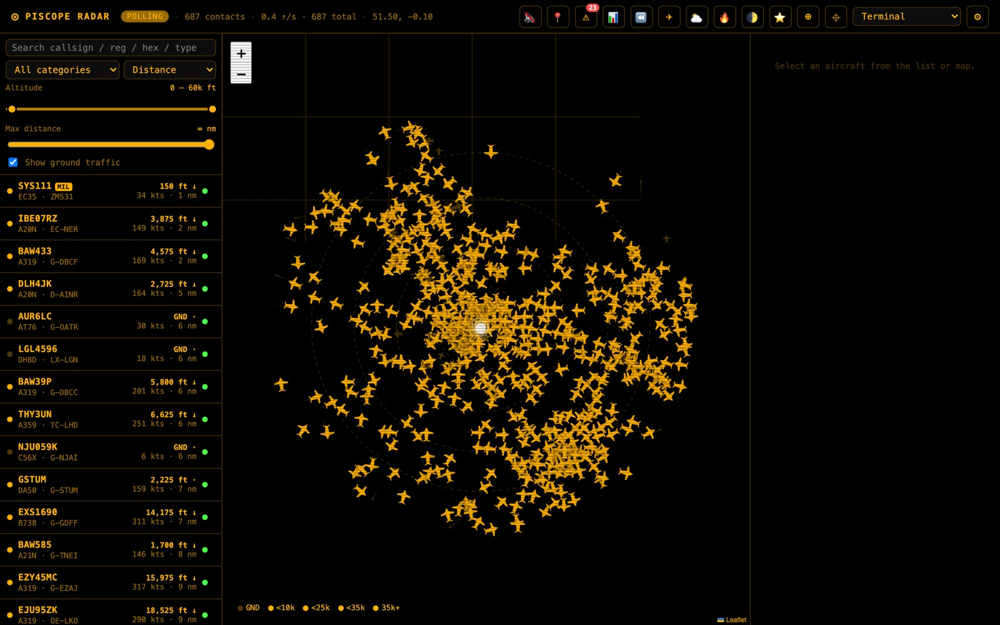
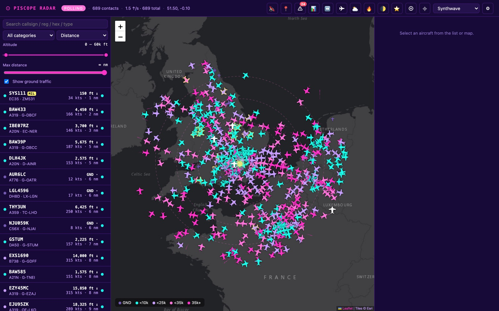
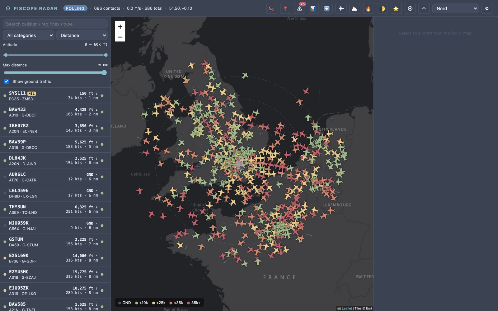
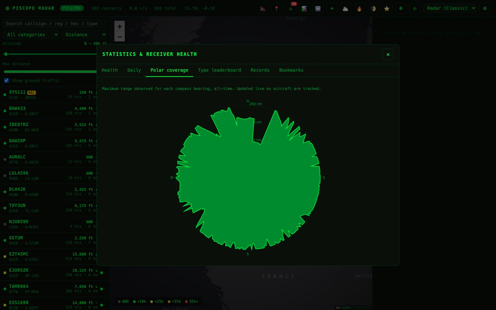
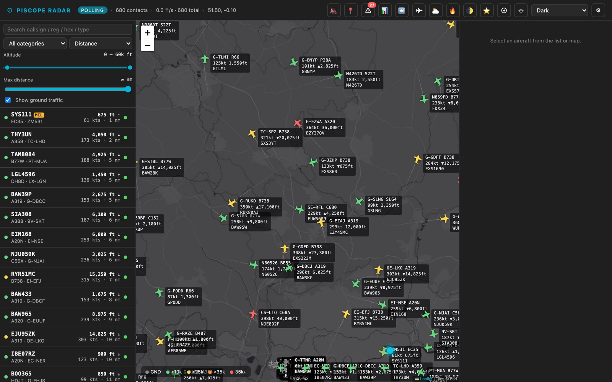
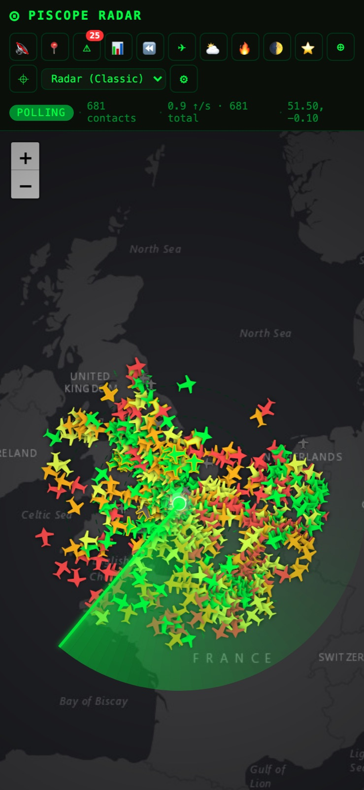

# PiScope Radar

> A self-hosted ADS-B flight-tracker for your Raspberry Pi. Sits alongside `tar1090` /
> PiAware and gives you a polished web UI with **11 themes**, an **animated radar sweep**,
> **all-time records**, **polar coverage diagrams**, **webhook alerts**, a **PWA installer**
> for your phone, and a lot more.
>
> Designed for LAN use — no auth, no HTTPS dance, no cloud accounts. Open
> `http://<pi-ip>/piscope` and you're tracking aircraft.



## Highlights

- **Live map** with custom rotated aircraft silhouettes, altitude-banded colouring, trails (single / by altitude / by speed gradient), range rings, and a receiver pulse marker
- **Animated radar sweep overlay** — two variants (classic phosphor 5s rotation, modern ATC 3s) with snapshot mode where aircraft positions only update as the sweep passes
- **11 themes** — radar (classic / modern), terminal CRT, light, dark, tactical, sectional (paper aviation chart), solarized (dark / light), nord, synthwave
- **Three map-label modes** — off, callsign only, or tar1090-style full info (reg · type / speed-altitude / callsign / origin-destination)
- **Detail panel** with a compass rose, signal-strength bar, squawk chip, performance section (IAS / TAS / Mach / roll / turn rate), autopilot section, photos, route, FlightAware integration
- **Event log** for military / emergency / watchlist / rare-type sightings
- **Webhook fan-out** to Discord / Slack / ntfy.sh / generic JSON endpoints
- **All-time records** — closest pass, lowest altitude, fastest, longest range, highest
- **Polar coverage diagram** — see your antenna's weakest direction at a glance
- **Type leaderboard** — what flies past most often
- **Traffic heatmap** layer, **day/night terminator**, **weather radar overlay** (RainViewer)
- **Replay** — scrub back through the last hour of feed
- **Multi-receiver merge** — point at extra tar1090s and dedupe by hex
- **Browser notifications + audio chimes** with stereo-panning by aircraft bearing
- **PWA install** — adds to your phone homescreen, offline-aware
- **Keyboard shortcuts** for everything (`?` for help)
- **`piscope` admin CLI** for status / logs / backup / restore / health

## A few looks

### Detail panel with compass rose, signal bars, photo, and route



### Theme gallery (11 included — a few favourites)

| Radar Modern (cyan ATC scope) | Terminal (CRT amber) |
|---|---|
|  |  |

| Synthwave (80s neon) | Nord (frost on polar night) |
|---|---|
|  |  |

### Polar coverage diagram

Tells you exactly which compass bearings your antenna is weakest in. All-time max
range per integer-degree bearing, updated live.



### tar1090-style full info labels

Toggle Settings → Map → "Aircraft labels" to switch between **off**, **callsign only**,
and **full info**. Full mode auto-hides below a configurable zoom so cluttered airspace
stays readable.



### Mobile / PWA

The topbar wraps onto a second row below 900 px. Install to your phone homescreen via
the browser's "Add to Home Screen" — it gets a manifest + service worker and behaves
like a real app.



## Quick install (Raspberry Pi OS / PiAware)

```bash
# On the Pi
git clone https://github.com/ajacks-595/piscope-radar.git
cd piscope-radar
sudo bash install.sh
```

The installer:
- Detects an existing **lighttpd** (PiAware default) and proxies `/piscope` through it,
  or installs **nginx** as a standalone vhost if lighttpd is absent
- Drops a systemd unit (`piscope.service`) that auto-restarts on failure
- Writes the `piscope` admin command to `/usr/local/bin/piscope`
- Backs up the live `piscope.db` to `piscope.db.bak` before upgrading
- Is idempotent — re-run after `git pull` to update

Open `http://<pi-ip>/piscope` in any browser on your LAN.

## First-run configuration

Click ⚙ to open Settings. The minimum to get aircraft flowing:

1. **Connection** tab: switch *Feed mode* to **Local tar1090** and set *tar1090 base URL* to
   `http://localhost/tar1090` (or whatever serves it on your Pi)
2. **General** tab: set *Outbound contact URL or email* to something like
   `https://github.com/ajacks-595/piscope-radar` — some upstream APIs (Planespotters) require this in
   the User-Agent
3. Optionally add a **FlightAware AeroAPI key** (FlightAware tab) and an **OpenAIP API key**
   (Map tab) for the aviation overlay

That's it. Aircraft should start appearing on the map.

## Day-to-day commands

```bash
piscope status      # systemd status
piscope logs        # tail journal
piscope health      # JSON health from /api/health
piscope backup      # download a DB zip to your home dir
piscope restore foo.zip
piscope url         # print http://<ip>/piscope
piscope help
```

## Architecture

- **Backend** — Python 3.11+ / FastAPI / asyncio / httpx / SQLite (`sqlite3` stdlib).
  Single uvicorn process at `127.0.0.1:8765`, reverse-proxied through lighttpd or nginx.
- **Frontend** — vanilla HTML / CSS / JavaScript. No framework, no bundler, no build step.
  Leaflet for the map, Canvas for the radar sweep, Web Audio for chimes.
- **Database** — one SQLite file at `/opt/piscope/piscope.db`. WAL mode, snapshot
  compression, single-transaction-per-poll batching. Tested with 400+ aircraft at
  ~10 ms SQL time per cycle on a Pi 4.
- **PWA** — manifest + service worker. App shell is cached for offline-ish use; live data
  always hits the network.

## Tech stack at a glance

| Layer | What |
|---|---|
| Web server | lighttpd (auto-detected) or nginx |
| ASGI | uvicorn (no `[standard]` extras — keeps things wheel-only on armhf) |
| Web framework | FastAPI + Starlette |
| HTTP client | httpx |
| Map | Leaflet 1.9 + Leaflet.heat |
| Storage | SQLite (WAL, incremental auto-vacuum, in-process LRU caches) |
| Service mgmt | systemd |

## Data sources & credits

PiScope Radar is just the glue. The real data comes from:

- [tar1090](https://github.com/wiedehopf/tar1090) — your local ADS-B feed (the default for "Local" feed mode)
- [adsb.lol](https://adsb.lol/) — global fallback feed if you don't have a receiver
- [hexdb.io](https://hexdb.io/) — airframe / registration lookup by ICAO hex
- [adsbdb.com](https://www.adsbdb.com/) — flight routes by callsign
- [Planespotters.net](https://www.planespotters.net/) — aircraft photos (please [add a
  contact URL](https://www.planespotters.net/photo/api) in Settings → General)
- [FlightAware AeroAPI](https://www.flightaware.com/commercial/aeroapi/) — optional, paid, on-demand flight data
- [OpenAIP](https://www.openaip.net/) — optional aviation chart overlay (free API key required)
- [RainViewer](https://www.rainviewer.com/) — weather radar overlay (no key)

## Security model

This project is designed for **LAN-only deployment**. Do not expose it to the public internet
without putting auth + HTTPS in front of it.

- No CORS (any browser-tab-origin on the LAN can hit the API; that's intentional for `http://pi.local/piscope`)
- WebSocket endpoint rejects cross-origin connections
- SSRF-safe URL validation for the tar1090 base URL and any extra feeds
- API keys stored only in SQLite, never echoed back to the browser
- Regex-validated hex / callsign at every API entry point
- XSS-safe rendering of upstream photo URLs

### Optional UFW firewall recipe (LAN-only lock-down)

If your Pi is reachable from outside your LAN (e.g. exposed via your router) and you want
to be doubly sure PiScope Radar isn't, install `ufw` and restrict everything to your private
subnet:

```bash
sudo apt-get install -y ufw
sudo ufw default deny incoming
sudo ufw default allow outgoing
# Replace 10.0.0.0/24 with your actual LAN subnet (run `ip -4 -o addr show` to check).
sudo ufw allow from 10.0.0.0/24 to any port 22 proto tcp comment 'SSH (LAN)'
sudo ufw allow from 10.0.0.0/24 to any port 80 proto tcp comment 'HTTP (LAN)'
sudo ufw enable
sudo ufw status verbose
```

## License

MIT — see [LICENSE](LICENSE). Have fun, please don't sell it back to me.
